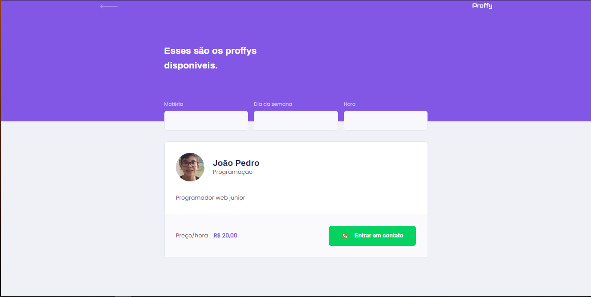

<h1 align="center">👨‍🏫Proffy</h1>

---
# Descrição
Proffy é uma plataforma de estudos dedicada ao ensino a distancia no app web você poderá cadastrar um professor, agendar uma aula, favoritar professores
# Jornada na Next Level Week

# Aula 1
- [x] - Criar projeto com o yarn
```bash
yarn create react-app web --template typescript
``` 
- [x] - Fazer o landing page
- [x] - Fazer a página listando os "professores"(Por enquanto não tem back end)
- [x] - Mobile first
- [x] - Responsividade
- [x] - Componentes funcionais
- [x] - Propriedades
# Resultados
## Landing Page


---

## Listagens dos Professores



---
## Projeto criado na Next Level Week #2
### Feito por 👨‍💻[João Pedro](https://jpres.dev)🚀